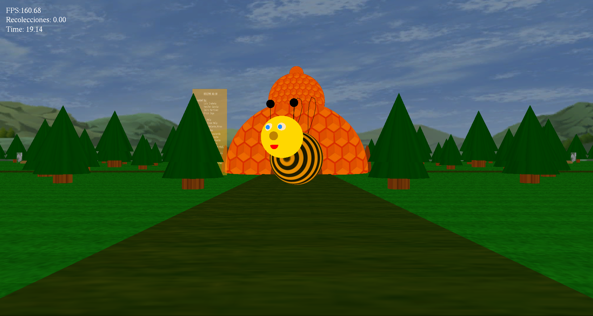

# Videojuego "La Colmena"

Videojuego educativo para niños menores de 12 años.




### Prerequisites

What things you need to install the software and how to install them

```
Sistema operativo Linux
	Procesador desde i3 en adelante 
```

### Installing

Para poder utilizar el videojuego se deberan instalar las siguientes librerias


```
	apt-get install build-essentials
	apt-get install cmake
	apt-get install libglu1-mesa-dev freeglut3-dev
	apt-get install libxmu-dev libxi-dev
	apt-get install libxmu-dev libxi-dev
	apt-get install libsoil-dev
	apt-get install libsdl2-dev
```

## Tree Files
├── LICENSE.md
├── README.md
├── screenshot.png
└── VideoJuego_LaColmena
    ├── AG_Proyecto_Final_La_Colmena1-5.pdf
    ├── build
    ├── CMakeLists.txt
    ├── main.cpp
    └── sources
        ├── funciones.h
        ├── imgs
        │   ├── 1.png
        │   ├── 2.png
        │   ├── 3.png
        │   ├── 4.png
        │   ├── abe.png
        │   ├── avion.png
        │   ├── celdas.png
        │   ├── cielo2.png
        │   ├── enemigo.png
        │   ├── fin.png
        │   ├── guardia.png
        │   ├── images.png
        │   ├── info2.png
        │   ├── info.png
        │   ├── reina.png
        │   └── tronco.png
        └── song
            └── vuelo_abeja.wav

## Version

v~1.0

## Authors

* **Luis Iraheta** - **  - (https://liluisjose1blog.wordpress.com)


## License

This project is licensed under the MIT License - see the [LICENSE.md](LICENSE.md) file for details

